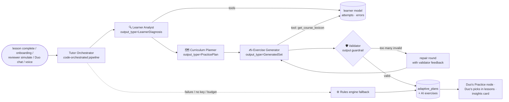
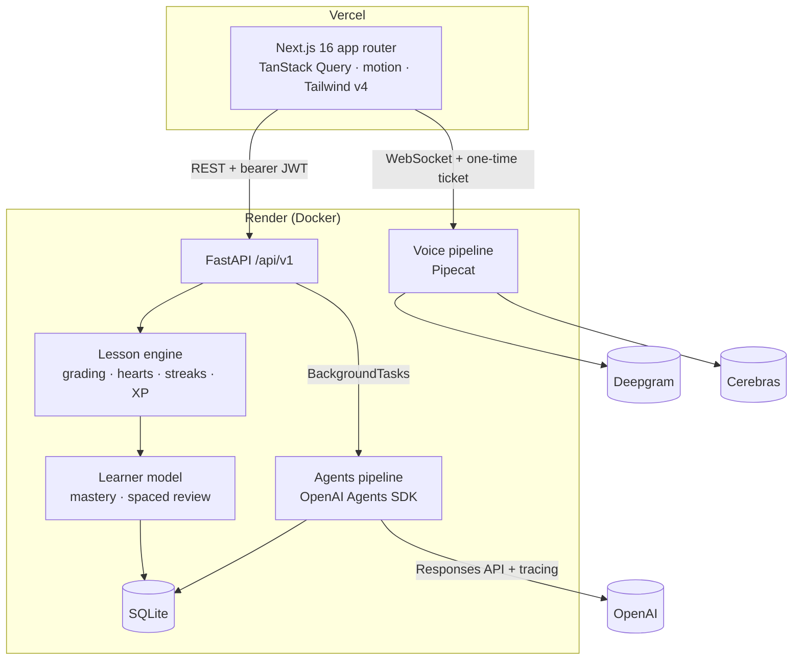
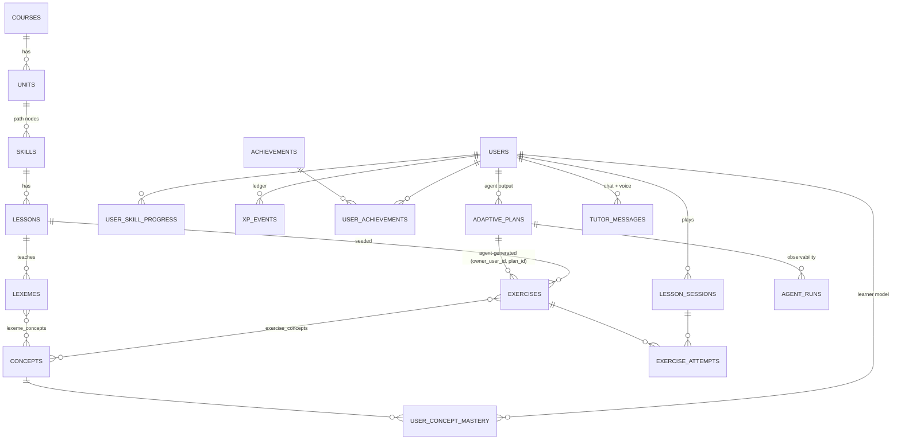

# Duolingo Clone + Duo AI: an adaptive, agentic tutor

> **A note to the Scaler AI Labs team, before you read anything else**
>
> I know the brief and the rubric are about full-stack: UI fidelity, schema, API, code quality.
> I built all of that, and it works: the learning path, the five exercise types, hearts, streaks,
> XP, leagues, quests, achievements, dark mode, mobile.
>
> But I'm being honest about where I spent my energy, so I won't waste your time pretending
> otherwise. **I deliberately bet on the agentic part.** A Duolingo clone that only replays a fixed
> list of questions is a quiz app. What makes a tutor good is noticing *why* you keep getting
> something wrong and changing what you practise next. So I built a team of agents with the
> **OpenAI Agents SDK** that watches every answer, diagnoses the misconception, plans a session
> and writes new exercises grounded in what you've already learned. On top of that there's a
> real-time **voice tutor** you can just talk to ("is *hola amigo* correct?") that answers in about 1.5s.
>
> It's a gamble on a rubric that doesn't ask for it. I took it because this is the work I want to
> do, and I'd rather show you that than a slightly shinier button. Everything below explains how
> it works and how you can try to break it.

**Live demo:** https://duolingo-clone-ai-tutor.vercel.app · **API:** https://duolingo-clone-api-wtpp.onrender.com/docs · **Stack:** Next.js 16 (TypeScript) · FastAPI · SQLite ·
OpenAI Agents SDK · Pipecat (Deepgram + Cerebras)

---

## Contents
1. [What to try in 3 minutes](#what-to-try-in-3-minutes)
2. [Features](#features)
3. [The agentic tutor (the interesting part)](#the-agentic-tutor)
4. [Voice Duo](#voice-duo)
5. [Architecture](#architecture)
6. [Database schema](#database-schema)
7. [API overview](#api-overview)
8. [Security & cost controls](#security--cost-controls)
9. [Scalability](#scalability)
10. [Testing & evals](#testing--evals)
11. [Run it locally](#run-it-locally)
12. [Deployment](#deployment)
13. [Assumptions & trade-offs](#assumptions--trade-offs)
14. [Project structure](#project-structure)

---

## What to try in 3 minutes

1. Open the app and click **Get started**. You're a demo learner with 3 days of history (a 3-day streak, the
   first two levels done). That history deliberately contains a pattern: **mostly el/la gender mistakes and missing accents**.
2. Within ~30s the agents analyse it. The right rail shows **Duo's insights** ("You keep defaulting to masculine
   articles, so I made 4 gender drills…"), and a purple **Duo's Practice** node appears on the path.
3. Open **Duo AI** in the sidebar (the "Tutor Brain"). You can see the whole multi-agent run: each agent's
   tool calls, latency and tokens, the diagnosis with evidence, the plan, every AI-written exercise with
   its rationale, and anything the validator rejected.
4. **Check it adapts to *new* behaviour.** In the 🧪 reviewer panel, pick a different profile
   (*"Confuses verb forms"*, *"Scrambles word order"*, *"Recognises but can't produce"*…). It injects
   ~14 realistic wrong answers through the real grader, then re-runs the agents. Watch the diagnosis and
   the exercises change. Or just play a lesson and get things wrong on purpose.
5. Press the 🎙️ button and ask Duo something out loud.
6. **Settings → Simulate next day** to test streaks, streak freezes and heart regeneration.

---

## Features

### Core Duolingo experience (the brief)
| Area | What's there |
|---|---|
| **Learning path** | 3 units / 13 nodes on a snaking path. Each node is locked, active or completed, with a progress ring, a bouncing **START** bubble and a popover. There are treasure chests (gems), unit trophies, a guidebook per unit and Legendary (crown) levels. |
| **Lesson player** | Five exercise types: **multiple choice (picture cards)**, **translate with a word bank** (animated tiles, or switch to the keyboard), **match pairs**, **fill in the blank**, **type the answer** (with accent keys). It has the signature green/red feedback bar, a progress bar and an "N in a row" combo. Mistakes come back at the end of the lesson. Keyboard shortcuts: 1–9 and Enter. |
| **Hearts** | You lose one per mistake. They regenerate lazily (1 every 4h), you can refill with gems or *practice to earn hearts*, and there's an out-of-hearts modal. |
| **Gamification** | XP, a daily goal, a streak with streak freezes (testable via simulated days), daily quests, 11 achievements, a weekly **Bronze League** of seeded learners that keep earning XP, gems, and a shop. |
| **Celebrations** | Confetti on the lesson-complete screen (XP, accuracy and time cards), a streak-flame screen, achievement toasts and sound effects (synthesised with Web Audio, no assets). |
| **Profile** | Stats, an XP chart, a streak calendar, achievements with progress, and "what Duo knows about you". |
| **Bonus** | Dark mode, responsive (mobile bottom nav), TTS for Spanish prompts, Legendary timed challenge, real league, achievements. |
| **Placeholders** | Speaking exercises, friends, Super, more languages, notifications: "Coming soon". |

The UI recreates Duolingo's design language: the palette (`#58CC02` green etc.), chunky 3D buttons
with a darker lip, rounded tiles, Nunito (the closest free font to Feather/DIN Round), and the
layout (sidebar · path · right rail). The owl mascot is **drawn from scratch in SVG**. No Duolingo
artwork or code was copied.

### Beyond the brief
- **Duo AI**: a multi-agent adaptive tutor, a Tutor Brain dashboard, a chat tutor with guardrails, and "Why? Ask Duo" on every wrong answer.
- **Voice Duo**: a real-time speech tutor (Pipecat: Deepgram STT → Cerebras → Deepgram TTS).
- **Reviewer simulator**: inject a learner profile's mistakes on demand and watch the system adapt.
- **Behavioural evals** for the agents, plus 30 unit and API tests, and CI.

---

## The agentic tutor

### The idea: two layers

```
 every answer ─► deterministic learner model (instant, no LLM)     ─► in-lesson adaptation
                 per-concept mastery · error type · spaced review       (missed items come back)
                                │
 lesson completes ─► background ┴─► MULTI-AGENT PIPELINE (OpenAI Agents SDK) ─► next session
                                    diagnose → plan → generate → validate        is rewritten
```

The lesson loop **never waits for an LLM**. Grading, error classification and the learner model
are deterministic and run on every answer. The agents run in the background after a lesson, so
their latency is invisible, and they reason over far richer data than a prompt stuffed with raw logs.

**Every answer is turned into a signal.** The grader doesn't only say right or wrong; it classifies
the error type:

| error_type | Example |
|---|---|
| `gender_article` | *la pan* instead of *el pan* |
| `agreement` | *la manzana es rojo* |
| `verb_form` | *yo come* instead of *yo como* |
| `accent` | *adios* instead of *adiós* (accepted as a typo, but logged) |
| `word_order`, `missing_word`, `extra_word`, `vocabulary` | |

Each exercise is tagged with **concepts** (`grammar.gender_articles`, `verb.ser`, `spelling.accents`…).
`user_concept_mastery` keeps a knowledge-tracing-style estimate per concept, with **recognition**
accuracy (choosing) and **production** accuracy (typing/building) tracked separately, plus a
spaced-repetition `next_review_at`.

### The agents



| Agent | Job | How |
|---|---|---|
| **Learner Analyst** | Work out *why* the learner fails, not just where | Investigates with 4 function tools (`get_concept_mastery`, `get_error_breakdown`, `get_recent_mistakes`, `get_session_history`). Outputs a typed `LearnerDiagnosis`: weak concepts with severity, recognition vs production weakness, **evidence quoted from the data** and the likely misconception. |
| **Curriculum Planner** | Turn the diagnosis into a session | Typed `PracticePlan`: which concepts, how many items, which formats (recognition weakness → choose/match; production weakness → type/translate), a difficulty ramp, spaced-review items, and a short message from Duo. |
| **Exercise Generator** | Write new exercises in the app's format | Must call `get_course_lexicon` first and **may only use vocabulary the learner has been taught**. Distractors are designed to probe the misconception. |
| **Validator** (output guardrail) | Never trust the LLM | Deterministic checks: real concept keys, answer among the choices, exactly one blank, unique pairs, **grounding** (the Spanish only uses taught words), and the answer must grade as correct through the real grader. If too many items fail, the guardrail trips and the generator gets **one repair round** with the validator's errors. Survivors are topped up with seeded exercises. |
| **Duo (chat)** | Conversational tutor | Uses the Analyst through **`.as_tool()`**, an instant `get_learning_snapshot` tool, `explain_concept`, and an **action tool `create_practice`** that schedules the pipeline. Behind an **input guardrail** (a Topic Guard agent) that blocks off-topic requests and prompt injection. |
| **Mistake Explainer** | "Why? Ask Duo" on a wrong answer | Gets the task, the learner's answer, the correct answer, the error type and the concept rule; returns a typed `Explanation`. About 1.5s. |

### Design decisions worth defending
- **Code-orchestrated, not LLM-routed.** The pipeline order is fixed and every hand-off is a
  Pydantic contract. Each agent still reasons and calls tools on its own. You get the
  intelligence of agents with the debuggability of a pipeline.
- **Deterministic guard-rails around LLM outputs.** The plan is bounds-checked, and there's one
  pedagogical invariant in code: *a production weakness is trained mostly by producing*. The
  evals showed the planner occasionally drifting on this, so I enforced it rather than hoping.
- **Graceful degradation.** No API key, budget spent, or an exception: the rule-based tutor
  produces the same outputs (diagnosis, plan, exercise ids) with zero LLM calls, so the app
  always adapts.
- **Observability as a feature.** Every agent invocation becomes an `agent_runs` row (status,
  latency, tokens, tool calls, structured output, trace id), and SDK tracing is on, so the same
  runs show up in the OpenAI Traces dashboard. The Tutor Brain page is built on this.
- **Idempotent and budgeted.** One pipeline per learner at a time (per-user lock), a per-learner
  daily agent budget, `max_turns`, and token caps.

### Where adaptation shows up in the product
- **Duo's Practice** node on the path, plus a *Start* button in the insights card.
- **"Duo's pick for you"**: up to 2 personalised exercises are mixed into every regular lesson.
- **Practice to earn hearts** targets your weakest and due-for-review concepts.
- The **insights card**, mastery bars, the Tutor Brain timeline and toasts ("Duo built you a new practice!").

---

## Voice Duo

A real-time voice tutor built on the same architecture as my previous Pipecat project:

```
browser mic ─ws─► Silero VAD ─► Deepgram nova-3 (language=multi: English + Spanish)
                                  ─► Cerebras gpt-oss-120b (low reasoning effort, fast tools)
browser speaker ◄─ws─ Deepgram Aura-2 TTS ◄─┘
```

- **Measured about 1.4–2.3s locally and ~2.8s on the deployed free-tier server**, from the end of
  your sentence to Duo's voice (synthetic speech streamed through the real WebSocket).
- Everything streams, so Duo starts speaking the first sentence while the LLM writes the rest.
- The learner's profile (weak concepts, recent mistakes) is **pre-loaded into the prompt** rather
  than fetched with a tool call, so there's no extra round-trip.
- Tools are cheap and in-process (`get_my_stats`), and the slow work is handed off:
  `create_practice` schedules the agent pipeline in the background.
- It uses a **WebSocket transport** rather than WebRTC, because PaaS hosts like Render don't
  route WebRTC's UDP. The browser uses `@pipecat-ai/client-js` with the WebSocket transport.
- Transcripts are saved to the same `tutor_messages` as text chat (with `channel=voice`).

---

## Architecture



**Backend layering** (`backend/app`):
`api/` (thin HTTP routes) → `services/` (domain logic: lesson engine, grading, gamification) →
`models/` (SQLAlchemy). `agents/` sits beside `services/` and reads through `learner_data.py`
read models. The agents never touch HTTP, and services never import agents. Domain rule violations
raise a `GameError` that the API maps to an HTTP error.

**Frontend** (`frontend/src`): client components talk to the API through a typed client
(`lib/api.ts`) and TanStack Query hooks (`lib/hooks.ts`). `components/` is split by domain:
`shell`, `path`, `lesson`, `exercises` (one component per type), `tutor`, and `ui`.

---

## Database schema



| Table | Purpose / notable columns |
|---|---|
| `courses` → `units` → `skills` → `lessons` | Content hierarchy. `skills.kind` = lesson / chest / trophy. `units.guidebook` (JSON). Unique `(parent, position)` ordering. |
| `exercises` | `type`, `prompt`, `payload` (JSON, type-specific contract in `services/exercise_types.py`), `difficulty`. `source` = seed/agent. Agent rows carry `owner_user_id`, `plan_id` and `rationale`, so generated content is per learner and traceable to the plan that produced it. |
| `concepts`, `exercise_concepts`, `lexemes`, `lexeme_concepts` | The knowledge graph. Concepts are what mastery and agents reason about. Lexemes (taught vocabulary) ground the generator. |
| `users` | Profile and gamification counters: `total_xp`, `gems`, `hearts` + `hearts_updated_at` (lazy regen), `streak_count`, `longest_streak`, `last_active_date`, `streak_freezes`, `daily_goal_xp`, `clock_offset_days` (demo time travel), `is_bot` (seeded league). |
| `user_skill_progress` | Lessons completed, crowns and Legendary per node. |
| `user_concept_mastery` | Mastery 0–1, attempts, **recognition vs production** counts, correct streak, `next_review_at`. |
| `lesson_sessions` | Mode (lesson/practice/personalized/legendary), `queue` (JSON, grows when mistakes are re-queued), hearts lost, combo, accuracy, XP, and the learner-local `day`. |
| `exercise_attempts` | Every answer: the raw answer JSON, correct, typo, **`error_type`**, time. |
| `xp_events` | The XP ledger, stamped with the learner-local day. Daily goal, streak calendar and weekly league are all aggregate queries over it. |
| `achievements`, `user_achievements` | Badges with metric + threshold. |
| `adaptive_plans` | Agent output: `diagnosis`, `plan` (incl. exercise ids and validation errors), `summary`, `engine` (agents/rules), status lifecycle `pending → ready → consumed / superseded / failed`. |
| `agent_runs` | One row per agent call: kind, agent, status, input, output, tool calls, tokens, latency, trace id, parent run. Also backs the daily budget. |
| `tutor_messages` | Chat and voice transcripts (memory for Duo), with a `blocked` flag from the guardrail. |

Indexes are on the hot paths (`attempts(user_id, created_at)`, `xp_events(user_id, day)`,
`plans(user_id, status)`, `agent_runs(user_id, created_at)`).

---

## API overview

All routes live under `/api/v1` and take `Authorization: Bearer <guest JWT>`. Interactive docs are at `/docs`.

| Method & path | Description |
|---|---|
| `POST /auth/guest` | Creates your own learner (pre-loaded demo history) and returns a JWT. Kicks off an onboarding tutor run. |
| `GET /me` · `PATCH /me/settings` | Learner state (applies heart regen and streak checks) · name, daily goal, sound, dark mode |
| `GET /path` | Units, nodes with status/progress, and the current Duo's Practice card |
| `POST /path/chest/{skill_id}` | Open a chest (gems) |
| `POST /sessions` | Start `{mode: lesson|practice|personalized|legendary, lesson_id?, skill_id?}`. Answers are never sent to the client. |
| `POST /sessions/{id}/answers` | Grade one answer server-side and return feedback, error type, hearts, re-queue and progress |
| `POST /sessions/{id}/complete` | XP, streak, progress and achievements; schedules the tutor pipeline in the background |
| `POST /sessions/{id}/quit` | Abandon |
| `GET /leaderboard` · `GET /quests` · `GET /profile` | League, daily quests, stats and achievements |
| `POST /shop/refill-hearts` · `POST /shop/streak-freeze` | Gem purchases (mocked currency) |
| `POST /dev/advance-day` | Demo mode: move this learner's clock forward a day |
| `GET /tutor/insights` · `GET /tutor/brain` | Insights card · the full Tutor Brain timeline |
| `POST /tutor/plan` | Re-run the agents now (optional focus concepts) |
| `POST /tutor/simulate` | Reviewer tool: inject a profile's mistakes, then re-run the agents |
| `GET/POST /tutor/chat` | Duo chat history / send (guardrailed) |
| `POST /tutor/explain` | Explain one of *your* attempts |
| `GET /voice/status` · `POST /voice/ticket` · `WS /voice/ws?ticket=` | Voice availability · single-use ticket · Pipecat stream |

---

## Security & cost controls
- **Secrets live only in env vars** (Render dashboard / local `backend/.env`, both gitignored). The
  frontend's only env var is the public API URL. The OpenAI, Deepgram and Cerebras keys never
  reach the browser, and every commit was scanned for key patterns.
- **Auth:** HS256 JWT guest tokens. Every query is scoped to the token's user. Sessions,
  attempts and generated exercises are ownership-checked, so you can't access another learner's data
  (there's a test for this). **The LLM can never choose a user id**: tools read the user from the run context.
- **Voice WebSocket:** the browser swaps its JWT for a **single-use, 60-second ticket**, so the
  long-lived token never appears in a URL or access log. Origins are checked, there's one live
  session per learner, sessions are capped at 3 minutes, and there are 15 per day.
- **Abuse and cost:** per-IP rate limit on guest creation, per-user limits on answers and tutor
  calls, a **daily agent budget per learner**, `max_turns` and token caps, and an input guardrail
  that blocks off-topic requests and prompt injection before the main model runs.
- **Server-side grading.** The client never receives answers (except match-pairs, which is checked tap by tap, like Duolingo).
- Strict CORS (no cookies), input validation with length limits on every body, security headers,
  a non-root Docker user, and generated content rendered as text only.

## Scalability
- **The LLM is off the request path.** Agents run in background tasks. To scale, swap
  `BackgroundTasks` for a queue (Arq/Celery + Redis); `run_pipeline()` is already a plain async
  function, so nothing else changes.
- **Stateless API** (JWT), so you can add instances. The in-memory pieces (rate limiter, voice
  tickets, pipeline locks) are behind tiny interfaces designed to move to Redis.
- **Postgres is a `DATABASE_URL` change** (SQLAlchemy 2.0, no SQLite-specific SQL). There are
  indexes on every hot query, and aggregates (XP, league) come from an append-only ledger.
- **Model and provider are config.** `OPENAI_MODEL`, and voice can switch Cerebras ⇄ OpenAI via env.
- **Voice** scales per connection. Each session is an isolated Pipecat worker; heavy content work is delegated.

---

## Testing & evals

```bash
cd backend
pytest -q            # 30 tests: grading, streaks, hearts, full lesson loop over HTTP, isolation
                     # between learners, simulator, validator and grounding, rules fallback
python -m evals.run  # live behavioural evals of the agents (needs OPENAI_API_KEY)
```

`evals/run.py` creates a clean learner for each **synthetic profile** (gender, accents,
production, word order, verbs), injects that profile's mistakes, runs the real pipeline in
parallel, and asserts the agents adapted correctly: the right concept is diagnosed first, the
plan focuses on it, and the exercise formats match the weakness. **Latest run: 27/27 checks
passing.** (The first run was 26/27: the planner under-weighted production practice for a
"recognises but can't produce" learner, which is why that rule is now enforced in code.)

Frontend: `tsc`, ESLint and `next build` are clean, and GitHub Actions runs all of this on every push.

---

## Run it locally

**Requirements:** Python 3.12+, Node 20.9+.

```bash
# 1. Backend
cd backend
python -m venv .venv && source .venv/bin/activate     # Windows: .venv\Scripts\activate
pip install -r requirements-dev.txt
cp .env.example .env    # add OPENAI_API_KEY (agents), DEEPGRAM_API_KEY + CEREBRAS_API_KEY (voice)
uvicorn app.main:app --reload --port 8000             # seeds the DB on first start

# 2. Frontend
cd ../frontend
cp .env.example .env.local                             # NEXT_PUBLIC_API_URL=http://localhost:8000
npm install && npm run dev                             # http://localhost:3000
```

Without any API keys the whole app still works: the tutor uses the rules engine and the voice button hides itself.
To reset the database, run `python -m app.seed.seed --reset`.

## Deployment
- **Frontend → Vercel** (root `frontend/`, env `NEXT_PUBLIC_API_URL`).
- **Backend → Render** via `render.yaml` (Docker, `/health` check). Set `OPENAI_API_KEY`,
  `DEEPGRAM_API_KEY`, `CEREBRAS_API_KEY` and `CORS_ORIGINS` in the dashboard. `JWT_SECRET` is generated.
- The free Render tier sleeps when idle (the first request takes about 30–50s) and its disk is
  ephemeral, so the DB is re-seeded on boot. If a learner's token no longer exists, the frontend
  silently creates a new guest. A persistent disk (or Postgres) makes progress permanent.

## Assumptions & trade-offs
- **Auth is simplified** per the brief: every visitor gets their own guest learner (so reviewers
  don't collide), identified by a signed token in localStorage.
- **One course** (Spanish for English speakers): 3 units, 21 lessons, ~250 seeded exercises
  generated from authored vocabulary and sentences by `seed/builder.py`, plus agent-generated
  exercises per learner.
- **Day logic is simulated per learner** (`clock_offset_days`), so streaks can be tested without waiting.
- **The league is seeded learners** whose weekly activity is topped up deterministically, so the league feels alive.
- **Audio:** browser speech synthesis for prompts, and Pipecat for the voice tutor. Speaking exercises are "coming soon".
- **Gems and Super are mocked.** Friends, notifications and more languages are placeholders.
- The design and mascot are original recreations of Duolingo's *style*. This is an educational
  project, not affiliated with Duolingo.

## Project structure
```
backend/
  app/
    api/v1/        learner.py · sessions.py · tutor.py        (thin HTTP layer)
    services/      lesson_engine · grading · hearts · streaks · xp · mastery · progress ·
                   achievements · leaderboard · guests · simulator · plans
    agents/        definitions (agents + prompts) · schemas (typed outputs) · tools · pipeline
                   (orchestrator) · validation (guardrail) · fallback (rules) · duo (chat/explain)
                   · observability (agent_runs, budget) · learner_data (read models)
    voice/         Pipecat pipeline · WebSocket route · config
    models/        content · learner · activity · agent
    seed/          content_es (authored course) · builder (exercise generation) · seed
  tests/  evals/  Dockerfile
frontend/src/
  app/            / · (app)/learn · tutor · leaderboard · quests · shop · profile · settings ·
                  soon/[feature] · lesson/[id] · practice
  components/     shell/ · path/ · lesson/ · exercises/ · tutor/ · ui/ · Mascot.tsx
  lib/            api.ts · hooks.ts · types.ts · sound.ts
render.yaml  .github/workflows/ci.yml
```

---

**Live app:** https://duolingo-clone-ai-tutor.vercel.app · **API docs:** https://duolingo-clone-api-wtpp.onrender.com/docs ·
**Repo:** https://github.com/Vishy204/duolingo-clone-ai-tutor

> The backend runs on Render's free tier, which sleeps when idle: if the first load spins for ~30–50s,
> that's the server waking up. After that it's fast.
