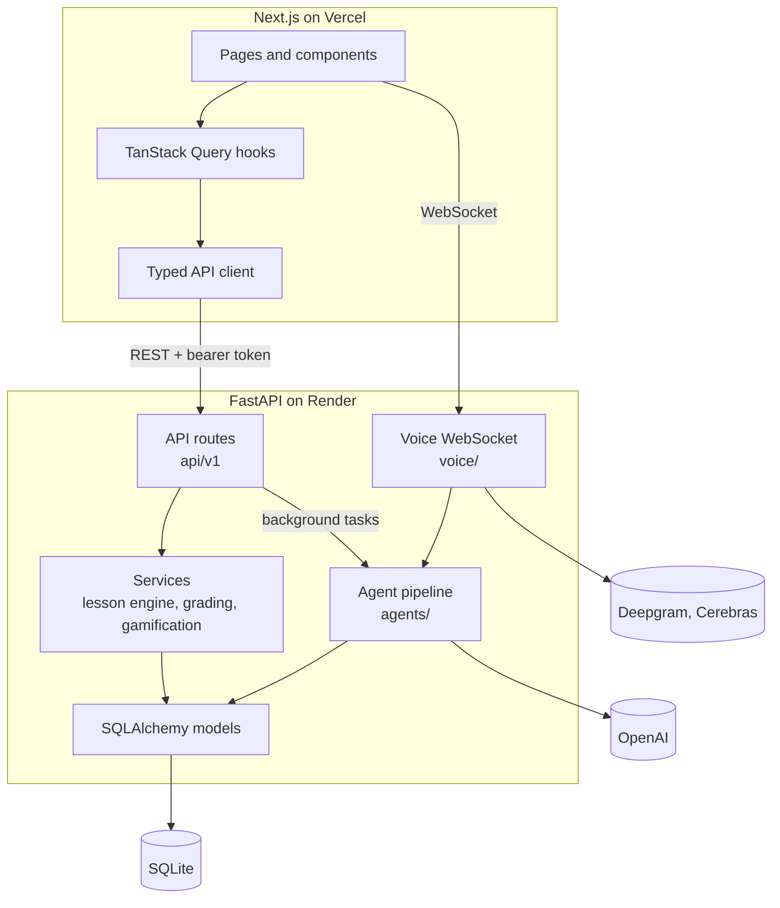
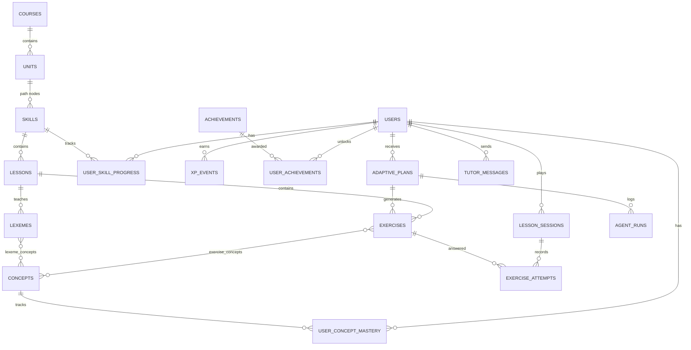
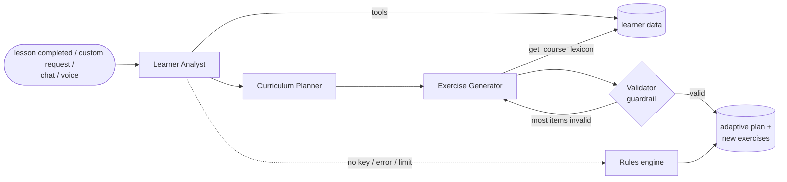

# Smartalingo

A Duolingo-style Spanish learning web app with an adaptive AI tutor, built for the Scaler AI Labs SDE Fullstack assignment.

| | |
|---|---|
| **Live app** | https://smartalingo.vercel.app |
| **API docs** | https://smartalingo-api.onrender.com/docs |
| **Repository** | https://github.com/Vishy204/smartalingo |

> The backend runs on Render's free tier. If the first request takes a while, the server is starting up.

## A note on focus

The assignment is evaluated as a full-stack project, and every core feature in the brief is implemented.
I chose to spend extra time on an agentic tutor built with the OpenAI Agents SDK, which studies each
learner's mistakes and rewrites their practice. Full-stack polish is not my strongest area; agents are,
so I would ask you to look at that part closely. It is documented in [Adaptive tutor](#adaptive-tutor-agents).

---

## Table of contents

1. [Feature coverage](#feature-coverage)
2. [Tech stack](#tech-stack)
3. [Setup](#setup)
4. [Architecture](#architecture)
5. [Database schema](#database-schema)
6. [API overview](#api-overview)
7. [Adaptive tutor (agents)](#adaptive-tutor-agents)
8. [Testing](#testing)
9. [Deployment](#deployment)
10. [Assumptions](#assumptions)
11. [Project structure](#project-structure)

---

## Feature coverage

| Brief | Implementation |
|---|---|
| **Learning path** | 3 units, 11 lesson levels, 3 chests and 3 trophies on a snaking path. Locked, available and completed states, progress rings, crowns, a "Start" bubble, unit guidebooks. Top bar with streak, gems and hearts. |
| **Lesson player** | Multiple choice, translate with a word bank (or keyboard), match pairs, fill in the blank, type the answer. Feedback bar with the correct solution, progress bar, combo counter, wrong answers re-queued at the end, keyboard shortcuts. |
| **Hearts** | One lost per mistake, regenerate over time (1 every 4 hours), refill with gems, or earn back through practice. Out-of-hearts modal. |
| **Gamification** | XP, daily goal, streak with streak freezes, daily quests, 11 achievements, a weekly league with seeded learners, gems and shop. Day logic can be simulated from Settings. |
| **Persistence** | All progress (XP, streak, hearts, skills, achievements, attempts) is stored per learner in SQLite. |
| **Content** | One Spanish course (21 lessons, ~250 exercises) seeded from authored content. A sample learner with partial progress is created on first visit. |
| **Profile** | Streak, XP, lessons, achievements with progress, weekly XP chart, streak calendar, per-topic mastery. |
| **Experience** | Original mascot (Smarto), animated feedback, lesson-complete and streak celebrations with confetti, modals, toasts, sound effects, settings. |
| **Placeholders** | Speaking exercises, friends, Super, more languages and notifications show "Coming soon". |
| **Bonus** | Text-to-speech for prompts, achievements, a working leaderboard, Legendary timed challenge, dark mode, responsive layout. |
| **Beyond the brief** | Adaptive AI tutor, Custom Practice tab, chat tutor, real-time voice tutor ([details](#adaptive-tutor-agents)). |

---

## Tech stack

| Layer | Technology |
|---|---|
| Frontend | Next.js 16 (App Router, TypeScript), React 19, Tailwind CSS v4, TanStack Query, Motion, lucide-react |
| Backend | Python 3.13, FastAPI, SQLAlchemy 2, Pydantic v2, PyJWT |
| Database | SQLite (WAL mode) |
| AI | OpenAI Agents SDK (`gpt-5-mini`), Pipecat for voice (Deepgram speech-to-text and text-to-speech, Cerebras LLM) |
| Hosting | Vercel (frontend), Render with Docker (backend) |
| Tooling | pytest, Ruff, ESLint, GitHub Actions |

---

## Setup

**Requirements:** Python 3.12+ and Node.js 20.9+.

```bash
# Backend
cd backend
python -m venv .venv
source .venv/bin/activate              # Windows: .venv\Scripts\activate
pip install -r requirements-dev.txt
cp .env.example .env                   # optional keys: OPENAI_API_KEY, DEEPGRAM_API_KEY, CEREBRAS_API_KEY
uvicorn app.main:app --port 8000       # creates and seeds the database on first start

# Frontend (new terminal)
cd frontend
cp .env.example .env.local             # NEXT_PUBLIC_API_URL=http://localhost:8000
npm install
npm run dev                            # http://localhost:3000
```

The app runs fully without API keys: the tutor falls back to its rules engine and the voice tutor is hidden.
To reset the database: `python -m app.seed.seed --reset`.

---

## Architecture



**Backend layers** (`backend/app`)

| Layer | Responsibility |
|---|---|
| `api/v1/` | Thin HTTP routes: validation, auth dependency, response shaping |
| `services/` | Domain logic: lesson engine, grading, hearts, streaks, XP, mastery, achievements, leaderboard |
| `models/` | SQLAlchemy models (content, learner, activity, agent) |
| `agents/` | Tutor agents, tools, schemas, orchestration, validation, rules fallback |
| `voice/` | Real-time voice pipeline and WebSocket route |
| `seed/` | Authored course content and exercise builder |

Services never import agents; agents read the database only through read models in `agents/learner_data.py`.
Domain rule violations raise a `GameError`, which the API maps to an HTTP error.

**Frontend** (`frontend/src`): pages in `app/`, components grouped by domain (`shell`, `path`, `lesson`,
`exercises` with one component per exercise type, `tutor`, `ui`), and a typed API client with query hooks in `lib/`.

**Key flows**

- *Lesson loop:* `POST /sessions` builds the exercise queue (answers are never sent to the client) →
  `POST /sessions/{id}/answers` grades on the server, updates hearts and mastery, re-queues mistakes →
  `POST /sessions/{id}/complete` awards XP, updates the streak, progress and achievements, and schedules the tutor.
- *Streak and daily goal:* derived from an XP ledger stamped with the learner's local day, so a day can be simulated per learner.

---

## Database schema



### Content

| Table | Key columns | Notes |
|---|---|---|
| `courses` | `slug` (unique), `title`, `from_lang`, `to_lang` | One seeded course (Spanish for English speakers). |
| `units` | `course_id` → courses, `position`, `title`, `color`, `guidebook` (JSON) | Unique `(course_id, position)`. |
| `skills` | `unit_id` → units, `position`, `title`, `kind` | Path nodes. `kind` = `lesson`, `chest` or `trophy`. Unique `(unit_id, position)`. |
| `lessons` | `skill_id` → skills, `position`, `title` | Unique `(skill_id, position)`. |
| `exercises` | `lesson_id` → lessons (nullable), `type`, `prompt`, `payload` (JSON), `difficulty`, `source`, `owner_user_id` → users, `plan_id` → adaptive_plans, `rationale` | `payload` holds the type-specific content and answer (contracts in `services/exercise_types.py`). `source` = `seed` or `agent`; agent-written exercises belong to one learner and one plan. |
| `concepts` | `key` (unique), `name`, `category`, `tip` | Grammar and vocabulary topics (e.g. `grammar.gender_articles`). |
| `exercise_concepts`, `lexeme_concepts` | composite keys | Many-to-many links to concepts. |
| `lexemes` | `lesson_id` → lessons, `text`, `translation` | Vocabulary taught per lesson; also limits which words AI-written exercises may use. |

### Learner and progress

| Table | Key columns | Notes |
|---|---|---|
| `users` | `username` (unique), `total_xp`, `gems`, `hearts`, `hearts_updated_at`, `streak_count`, `longest_streak`, `last_active_date`, `streak_freezes`, `daily_goal_xp`, `clock_offset_days`, `settings` (JSON), `is_bot` | Hearts regenerate lazily from `hearts_updated_at`. `clock_offset_days` simulates days. `is_bot` marks seeded league learners. |
| `user_skill_progress` | `user_id`, `skill_id`, `lessons_completed`, `crowns`, `is_legendary`, `completed_at` | Unique `(user_id, skill_id)`. Drives node states on the path. |
| `user_concept_mastery` | `user_id`, `concept_id`, `mastery` (0–1), `attempts`, `correct`, `recognition_*`, `production_*`, `correct_streak`, `next_review_at` | Unique `(user_id, concept_id)`. Updated on every answer; recognition (choosing) and production (typing) are tracked separately. |
| `achievements` | `key` (unique), `title`, `metric`, `threshold` | Badge definitions. |
| `user_achievements` | `user_id`, `achievement_id`, `unlocked_at` | Unique `(user_id, achievement_id)`. |

### Activity

| Table | Key columns | Notes |
|---|---|---|
| `lesson_sessions` | `user_id`, `lesson_id`, `skill_id`, `plan_id`, `mode`, `status`, `queue` (JSON), `answered`, `hearts_lost`, `xp_earned`, `accuracy`, `day` | `mode` = `lesson`, `practice`, `personalized` or `legendary`. `queue` grows when mistakes are re-queued. |
| `exercise_attempts` | `session_id`, `user_id`, `exercise_id`, `answer` (JSON), `is_correct`, `is_typo`, `error_type`, `time_ms` | Every answer. `error_type` classifies the mistake (e.g. `gender_article`, `verb_form`, `accent`). Index `(user_id, created_at)`. |
| `xp_events` | `user_id`, `amount`, `source`, `day` | Append-only XP ledger. Daily goal, streak calendar and weekly league are queries over it. Index `(user_id, day)`. |

### Tutor

| Table | Key columns | Notes |
|---|---|---|
| `adaptive_plans` | `user_id`, `status`, `trigger`, `engine`, `diagnosis` (JSON), `plan` (JSON), `focus_concepts`, `summary` | One per tutor run. Status `pending → ready → consumed`, or `superseded` / `failed`. Index `(user_id, status)`. |
| `agent_runs` | `user_id`, `plan_id`, `parent_id`, `kind`, `agent_name`, `status`, `output` (JSON), `tool_calls`, `input_tokens`, `output_tokens`, `latency_ms`, `trace_id` | One row per agent call; also counts toward the daily AI limit. Index `(user_id, created_at)`. |
| `tutor_messages` | `user_id`, `role`, `content`, `channel`, `blocked` | Chat and voice transcripts. |

**Design choices**

- The content hierarchy uses ordered positions with unique constraints, so paths render deterministically.
- Exercise content is JSON per type, which keeps one `exercises` table for all five types and for AI-written items.
- Concepts link content to learner mastery, which is what both the path recommendations and the agents reason about.
- XP is stored as events rather than a running counter per day, so daily, weekly and calendar views need no extra tables.
- Foreign keys cascade on delete, and every hot query has an index.

---

## API overview

All routes are under `/api/v1` and require `Authorization: Bearer <token>` except guest creation. Interactive docs: `/docs`.

| Method | Path | Purpose |
|---|---|---|
| POST | `/auth/guest` | Create a learner with sample progress and return a token |
| GET | `/me` | Learner state (applies heart regeneration and streak checks) |
| PATCH | `/me/settings` | Name, daily goal, sound, dark mode |
| GET | `/path` | Units and nodes with status and progress |
| POST | `/path/chest/{skill_id}` | Open a treasure chest |
| GET | `/profile` | Stats, achievements, XP history, mastery |
| GET | `/quests` | Daily quests |
| GET | `/leaderboard` | Weekly league |
| POST | `/shop/refill-hearts`, `/shop/streak-freeze` | Gem purchases (mocked currency) |
| POST | `/dev/advance-day` | Simulate the next day for this learner |
| POST | `/sessions` | Start a lesson, practice, personalized or legendary session |
| POST | `/sessions/{id}/answers` | Grade one answer on the server |
| POST | `/sessions/{id}/complete` | Award XP, update streak, progress and achievements |
| POST | `/sessions/{id}/quit` | Abandon a session |
| GET | `/tutor/insights` | Latest tutor plans for the right rail and notifications |
| GET | `/tutor/brain` | Full tutor history for the "How Smarto learns" tab |
| GET, POST | `/tutor/custom` | Custom Practice: topics with mastery and practices; build one |
| POST | `/tutor/plan` | Re-run the tutor now |
| POST | `/tutor/simulate` | Add realistic sample mistakes for a learner type (demo tool) |
| GET, POST | `/tutor/chat` | Chat history and send a message |
| POST | `/tutor/explain` | Explain a wrong answer |
| GET | `/voice/status` | Voice availability and remaining chats |
| POST | `/voice/ticket` | Single-use ticket for the voice WebSocket |
| WS | `/voice/ws?ticket=` | Real-time voice session |

---

## Adaptive tutor (agents)

### Overview

Two layers keep the lesson fast while the tutor stays smart:

```
every answer  ->  deterministic learner model (no LLM)        ->  in-lesson adaptation
                  error type, per-topic mastery, spaced review     (mistakes come back)
                          |
lesson ends   ->  multi-agent pipeline in the background       ->  next practice is rewritten
                  diagnose -> plan -> write -> validate
```

The grader classifies every wrong answer (`gender_article`, `agreement`, `verb_form`, `accent`,
`word_order`, `missing_word`, `extra_word`, `vocabulary`) and updates per-topic mastery. The agents run
after the lesson, or immediately when the learner asks, and never block the lesson.

### Pipeline



| Agent | Role | Output |
|---|---|---|
| Learner Analyst | Finds why the learner fails, using tools for mastery, error breakdown, recent mistakes and session history | `LearnerDiagnosis`: weak topics, severity, recognition vs production, evidence, likely misconception |
| Curriculum Planner | Turns the diagnosis into a session and picks formats (recognition gaps → choose/match, production gaps → type/translate) | `PracticePlan` |
| Exercise Generator | Writes exercises in the app's formats, using only vocabulary from `get_course_lexicon` | `GeneratedSet` |
| Validator (output guardrail) | Checks concepts, answers, blanks, pairs, vocabulary grounding, and that every answer grades correct through the real grader; one repair round if most of a batch fails | Valid exercises |
| Smarto (chat) | Conversational tutor; uses the Analyst via `.as_tool()`, `get_learning_snapshot`, `explain_concept`, and `create_practice`; behind an input guardrail for off-topic requests and prompt injection | Reply |
| Mistake Explainer | Explains a specific wrong answer | `Explanation` |

**Design decisions**

- **Code-orchestrated pipeline.** The order is fixed and every hand-off is a typed Pydantic schema; each agent still reasons and calls tools independently.
- **Deterministic guard-rails.** Plans are bounds-checked in code, and one teaching rule is enforced: a production weakness is trained mostly by producing.
- **Graceful fallback.** Without an API key, after an error, or past the daily limit, a rules engine produces the same outputs with no LLM calls.
- **Observability.** Every agent call is stored in `agent_runs` and traced; the "How Smarto learns" tab shows each update as four steps: what Smarto saw, concluded, changed, and wrote.
- **Limits.** One pipeline per learner at a time, 15 AI actions per learner per day, 25 voice chats per IP per day, `max_turns`, and tools that read the learner from the run context rather than from model arguments.

### Custom Practice

A sidebar tab where the learner picks up to three topics and receives a practice on exactly those topics in about 30 seconds.
Asking Smarto in chat or by voice ("make me a practice on animal names") creates the same kind of practice.

- Only the requested topics are used; the planner's choice is overridden in code.
- Each request gets about eight exercises in mixed formats, including topics not yet reached in the course.
- Course exercises used to fill gaps stay on topic and are never repeated in a session.
- Custom practices are kept in the tab, can be replayed, do not cost hearts, and trigger a notification when ready.

### Voice tutor

```
microphone -> WebSocket -> Silero VAD -> Deepgram STT (English + Spanish) -> Cerebras LLM -> Deepgram TTS -> speaker
```

Every stage streams, and the learner's weak topics are loaded into the prompt in advance, so answers take about
2–4 seconds. The greeting is spoken directly without an LLM call, the voice stack is warmed at server start, and the
learner can switch the microphone on and off during a call. WebSocket is used instead of WebRTC because the host
does not route WebRTC's UDP traffic.

### Evaluations

`python -m evals.run` creates a learner per synthetic profile (gender, accents, production, word order, verbs),
injects that profile's mistakes, runs the real pipeline, and checks that the right topic is diagnosed first,
the plan targets it, and the formats match the weakness. Latest run: **27/27**.

### Where the code lives

| Path | Contents |
|---|---|
| `backend/app/agents/pipeline.py` | Orchestrator, plan guard-rails, generate-validate-repair loop, persistence |
| `backend/app/agents/definitions.py`, `schemas.py` | Agents, prompts and typed outputs |
| `backend/app/agents/tools.py`, `learner_data.py` | Agent tools and the read models behind them |
| `backend/app/agents/validation.py`, `fallback.py` | Output guardrail and rules engine |
| `backend/app/agents/duo.py` | Smarto chat and mistake explanations |
| `backend/app/voice/` | Voice pipeline and WebSocket route |
| `backend/app/services/grading.py`, `mastery.py` | Error classification and the learner model |
| `frontend/src/app/(app)/custom/`, `components/tutor/` | Custom Practice tab, chat, voice, "How Smarto learns" |

---

## Testing

```bash
cd backend
pytest -q              # 36 tests: grading, streaks, hearts, full lesson loop over HTTP,
                       # learner isolation, custom practice, validator, rules fallback
python -m evals.run    # behavioural evaluation of the agents (requires OPENAI_API_KEY)

cd ../frontend
npx tsc --noEmit && npm run lint && npm run build
```

GitHub Actions runs the backend and frontend checks on every push.

---

## Deployment

| Part | Host | Configuration |
|---|---|---|
| Frontend | Vercel | Root `frontend/`; `NEXT_PUBLIC_API_URL` points to the backend |
| Backend | Render (Docker) | `render.yaml`; environment variables for the AI keys, `CORS_ORIGINS` and `JWT_SECRET`; health check `/health` |

Render's free disk is ephemeral, so the database is re-seeded on each deploy; if a stored token no longer
matches a learner, the frontend creates a new guest automatically. A scheduled workflow keeps the free instance awake.

---

## Assumptions

- Authentication is simplified as allowed by the brief: each visitor gets their own guest learner, identified by a signed token.
- One language course is seeded; content is small but covers all five exercise types.
- Days can be simulated per learner (Settings → Simulate next day) to test streaks and heart regeneration.
- The league uses seeded learners whose weekly XP is generated deterministically.
- Gems, Super and in-app purchases are mocked; speaking exercises, friends and more languages are placeholders.
- Audio uses the browser's speech synthesis for prompts; the voice tutor is an extra feature.
- The visual design follows Duolingo's style with an original mascot and icons; no Duolingo assets are used.

---

## Project structure

```
backend/
  app/
    api/v1/        learner, sessions, tutor routes
    services/      lesson engine, grading, hearts, streaks, xp, mastery, progress, achievements,
                   leaderboard, guests, simulator, plans
    agents/        definitions, schemas, tools, pipeline, validation, fallback, duo, observability,
                   learner_data
    voice/         Pipecat pipeline, WebSocket route, config
    models/        content, learner, activity, agent
    seed/          authored course content, exercise builder, seeding
  tests/  evals/  Dockerfile
frontend/src/
  app/             landing, (app)/learn, tutor, custom, leaderboard, quests, shop, profile,
                   settings, soon/[feature], lesson/[id], practice
  components/      shell, path, lesson, exercises, tutor, ui, Mascot
  lib/             api client, query hooks, types, sound
render.yaml  .github/workflows/
```
