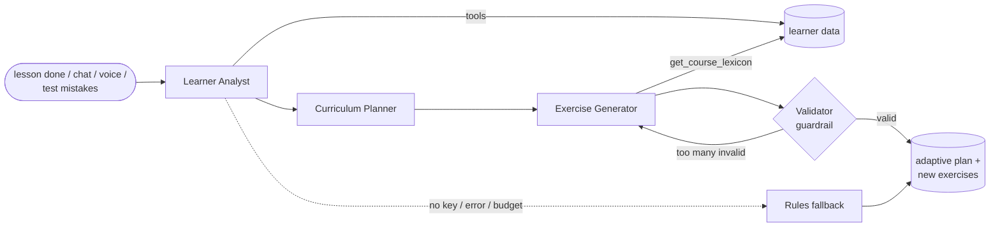

# Smartalingo

A Duolingo-style Spanish app with an AI tutor that learns from your mistakes and rewrites your practice.

**Live app:** https://smartalingo.vercel.app · **API docs:** https://smartalingo-api.onrender.com/docs
**Repo:** https://github.com/Vishy204/smartalingo · **Stack:** Next.js 16 (TypeScript) · FastAPI · SQLite · OpenAI Agents SDK · Pipecat

> The backend is on Render's free tier. If the first load hangs for 30–50s, the server is waking up.

---

## A note to the Scaler AI Labs team

I know this assignment is evaluated as a full-stack project: UI fidelity, schema, API design, code
quality. I built that part properly. The path, all five exercise types, hearts, streaks, XP,
leagues, quests and achievements all work.

But I want to be upfront: **I put most of my effort into the agentic part.** If the evaluation were
only about full-stack polish, that's honestly not where I'm strongest, and I'd rather not pretend
otherwise. Agents are what I'm good at and what I want to work on. A Duolingo clone that replays a
fixed list of questions is a quiz app. What makes a tutor useful is noticing *why* you keep getting
something wrong and changing what you practise next. That's what I built, and it's the part I'd ask
you to look at most closely.

---

## Try it in 3 minutes

1. Click **Get started**. You get your own learner with a few days of history. That history
   deliberately contains a pattern: mostly *el/la* gender mistakes and missing accents.
2. Within ~30s the tutor has analysed it. A purple **Smarto's Practice** node appears on the path and the
   right rail explains what Smarto noticed.
3. Open **Smarto → How Smarto learns**. You see the latest adaptation in four steps: *what Smarto saw* (your
   mistakes by type), *what it concluded* (each weak topic, the evidence, the likely reason, and the
   exact mistakes that led there), *what it changed*, and *the exercises it wrote for you*.
4. **Check it adapts to new behaviour.** Under *Try it: give Smarto new mistakes*, pick a learner type
   ("Confuses verb forms", "Scrambles word order", "Recognises but can't produce"...). It adds ~14
   realistic wrong answers through the real grader and re-runs the agents. The steps fill in live, so
   you can check the diagnosis matches what you picked. Or play a lesson and get things wrong on purpose.
5. **Custom Practice** (sidebar): pick up to 3 topics and press *Build practice*. Smarto builds it in
   ~30s, a notification pops up when it's ready (and a browser notification if you allowed it), and it
   stays in the tab so you can start it, or practise it again, any time. Custom practice never costs
   hearts, and topics you haven't reached in the course work too.
6. **Smarto → Talk to Smarto**: ask in text or by voice, e.g. *"Is hola amigo correct?"*, or *"make me a
   practice on animal names"*. Smarto builds a practice on exactly the topics you named (nothing extra)
   and tells you to check the Custom Practice tab once it's ready.

---

## How the agentic tutor works

### Two layers

```
every answer  ->  deterministic learner model (instant, no LLM)   ->  in-lesson adaptation
                  error type · per-topic mastery · spaced review       (missed items come back)
                          |
lesson ends   ->  multi-agent pipeline in the background           ->  next practice is rewritten
                  diagnose -> plan -> write -> validate
```

The lesson never waits for an LLM. Grading and the learner model are deterministic and run on every
answer; the agents run after the lesson, so their latency is invisible.

**Every answer becomes a signal.** The grader doesn't just say right or wrong. It classifies the
mistake: `gender_article` (*la pan*), `agreement` (*la manzana es rojo*), `verb_form` (*yo come*),
`accent` (*adios*, accepted as a typo but logged), `word_order`, `missing_word`, `extra_word`,
`vocabulary`. Each exercise is tagged with concepts, and every learner has a mastery score per
concept, tracked separately for **recognition** (choosing) and **production** (typing/building).

### The pipeline



| Agent | What it does |
|---|---|
| **Learner Analyst** | Works out *why* you fail, not just where. Investigates with four tools (`get_concept_mastery`, `get_error_breakdown`, `get_recent_mistakes`, `get_session_history`) and returns a typed `LearnerDiagnosis`: weak topics, severity, recognition vs production weakness, evidence quoted from the data, and the likely misconception. |
| **Curriculum Planner** | Turns the diagnosis into a typed `PracticePlan`: which topics, how many items, and which formats (a recognition weakness gets choose/match; a production weakness gets type/translate), plus a short message to the learner. |
| **Exercise Generator** | Writes new exercises in the app's exact format. It must call `get_course_lexicon` first and may only use words the learner has been taught. Distractors are designed to probe the misconception. |
| **Validator** (output guardrail) | Deterministic checks on every generated item: real concepts, answer among the choices, grounding (only taught words), and the answer must grade as correct through the real grader. If too many fail, the generator gets one repair round with the errors. Gaps are filled with course exercises. |
| **Smarto (chat)** | A conversational tutor. Uses the Analyst via `.as_tool()`, a fast `get_learning_snapshot` tool, `explain_concept`, and an action tool `create_practice` that kicks off the pipeline. An input guardrail agent blocks off-topic requests and prompt injection. |
| **Mistake Explainer** | "Why?" on a wrong answer. Gets the task, your answer, the correct answer, the error type and the rule; returns a short typed explanation (~1.5s). |

### Design decisions

- **Code-orchestrated, not LLM-routed.** The order is fixed and every hand-off is a Pydantic schema.
  Each agent still reasons and calls tools on its own. Agent intelligence, pipeline debuggability.
- **Never trust the LLM blindly.** Plans are bounds-checked, generated exercises are validated, and one
  teaching rule lives in code: *a production weakness is trained mostly by producing*. The evals
  caught the planner drifting on this, so I enforced it instead of hoping.
- **Practice on demand.** The Custom Practice tab (`POST /tutor/custom`) and Smarto's `create_practice`
  tool (chat and voice) start the same pipeline with your topics. An explicit request is never dropped
  (it waits behind a running update), the topics you asked for override the planner, and they may use
  course lessons you haven't reached yet. Custom practices are their own family: they stay in the tab
  and are never replaced by the automatic plan behind the path's Smarto's Practice node. A requested
  topic gets ~8 exercises in mixed formats; course top-ups stay on topic and never repeat a sentence.
- **Always adapts.** No API key, budget used up, or an exception: a rules engine produces the same
  outputs with zero LLM calls.
- **Observable.** Every agent call is stored in `agent_runs` (status, latency, tokens, tool calls,
  output, trace id) and traced in the OpenAI dashboard. The "How Smarto learns" tab reads from this.
- **Safe to run in public.** One pipeline per learner at a time, a limit of 15 AI actions per learner per day
  (tutor updates, custom practices, chat messages, explanations; after that the rules engine takes over),
  25 voice chats per IP per day,
  `max_turns` and token caps, rate limits, and the LLM can never pick a user id (tools read it from
  the run context).

### Where you see the adaptation

The **Smarto's Practice** node, up to 2 personalised exercises mixed into regular lessons, "practice to
earn hearts" targeting weak topics, the insights card, the **Custom Practice** tab, and the **How Smarto
learns** tab.

### Voice tutor

```
mic -> WebSocket -> Silero VAD -> Deepgram STT (English + Spanish) -> Cerebras LLM -> Deepgram TTS -> speaker
```

Everything streams, and the learner's weak topics are pre-loaded into the prompt instead of fetched
with a tool, so Smarto answers in about 2–4s end to end on the hosted server. Start-up is tuned too:
the greeting is spoken straight to text-to-speech (no LLM call), the browser preloads the voice client,
the server warms the voice stack at boot, and a scheduled ping keeps the free instance from sleeping.
Slow work is handed off:
`create_practice` schedules the agent pipeline in the background. It uses WebSocket instead of WebRTC
because PaaS hosts don't route WebRTC's UDP. The browser exchanges its token for a single-use 60s
ticket, so no long-lived token ends up in a URL.

### Evals

`python -m evals.run` creates a fresh learner per synthetic profile (gender, accents, production,
word order, verbs), injects that profile's mistakes, runs the real pipeline, and checks that the
right topic is diagnosed first, the plan focuses on it, and the exercise formats match the weakness.
**Latest run: 27/27.** The first run was 26/27, which is how I found the production-practice drift above.

### Where the code lives

| Folder / file | What's inside |
|---|---|
| `backend/app/agents/pipeline.py` | The orchestrator: runs Analyst → Planner → Generator → Validator, plan guard-rails, saving, rules fallback |
| `backend/app/agents/definitions.py` | Every agent and its prompt |
| `backend/app/agents/schemas.py` | The typed (Pydantic) outputs each agent must return |
| `backend/app/agents/tools.py`, `learner_data.py` | The tools agents call and the database read models behind them |
| `backend/app/agents/validation.py` | The output guardrail that checks every generated exercise |
| `backend/app/agents/duo.py` | Smarto chat: topic guard, tools (`create_practice` …), "Why?" explanations |
| `backend/app/agents/fallback.py`, `observability.py` | Rules engine without an LLM; `agent_runs` logging and the daily limit |
| `backend/app/voice/` | Voice tutor: Pipecat pipeline (`pipeline.py`) and WebSocket + tickets (`routes.py`) |
| `backend/app/services/grading.py`, `mastery.py` | Error classification and the per-topic learner model |
| `backend/evals/run.py` | Behavioural evals of the agents |
| `frontend/src/components/tutor/` | Chat, voice, and the "How Smarto learns" page |
| `frontend/src/app/(app)/custom/` | The Custom Practice tab (topic picker, practice list, notifications in `AppShell.tsx`) |

---

## The full-stack part

**Features:** a snaking learning path (3 units, 11 lesson levels, chests, trophies, guidebooks);
five exercise types (multiple choice, word-bank translation, match pairs, fill the blank, type the
answer); the green/red feedback bar with mistakes re-queued; hearts with regeneration and refills;
XP, daily goal, streaks with freezes; daily quests, 11 achievements, a weekly league; a Custom Practice tab; profile,
shop, dark mode, mobile layout. Smarto (the violet bird mascot) and the icons are original; no Duolingo assets are used.

**Architecture:** `backend/app/api` (thin routes) → `services` (lesson engine, grading, gamification)
→ `models` (SQLAlchemy). `agents/` sits beside `services/` and reads through read models in
`learner_data.py`. The frontend uses a typed API client and TanStack Query.

### Database schema

| Table | Purpose |
|---|---|
| `courses → units → skills → lessons → exercises` | Content. `exercises.payload` is JSON per type; `source` is seed or agent. Agent rows carry `owner_user_id`, `plan_id` and `rationale`. |
| `concepts`, `exercise_concepts`, `lexemes`, `lexeme_concepts` | What the learner model and agents reason about; lexemes (taught words) ground the generator. |
| `users` | XP, gems, hearts (+ regen timestamp), streak, freezes, daily goal, `clock_offset_days` for demo time travel. |
| `user_skill_progress` | Progress and crowns per path node. |
| `user_concept_mastery` | Mastery 0–1, recognition vs production counts, `next_review_at`. |
| `lesson_sessions`, `exercise_attempts` | Every session and every answer, with its `error_type`. |
| `xp_events` | XP ledger; daily goal, streak calendar and league are queries over it. |
| `achievements`, `user_achievements` | Badges. |
| `adaptive_plans` | Agent output: diagnosis, plan, learner message, status `pending → ready → consumed`. |
| `agent_runs` | One row per agent call (observability and the daily budget). |
| `tutor_messages` | Chat and voice transcripts (Smarto's memory). |

### API (`/api/v1`, bearer token, docs at `/docs`)

| Endpoint | Purpose |
|---|---|
| `POST /auth/guest` | Create your own learner + token |
| `GET /me`, `GET /path`, `GET /profile`, `GET /leaderboard`, `GET /quests` | App state |
| `POST /sessions`, `POST /sessions/{id}/answers`, `POST /sessions/{id}/complete` | Lesson loop, graded server-side; completing a lesson triggers the tutor |
| `GET /tutor/brain`, `POST /tutor/plan`, `POST /tutor/simulate` | How Smarto learns, re-run, inject test mistakes |
| `GET /tutor/custom`, `POST /tutor/custom` | Custom Practice: topics with mastery and your practices; build one (1–3 topics) |
| `POST /tutor/chat`, `POST /tutor/explain` | Chat and mistake explanations |
| `POST /voice/ticket`, `WS /voice/ws` | Voice session |

---

## Security

- **Keys never leave the server.** OpenAI, Deepgram and Cerebras keys live only in Render's environment
  variables (and a gitignored local `.env`). The frontend's only setting is the public API URL.
- **Audited** before submission: every real key was checked against the full git history and every JS
  file the live site serves (no matches). GitHub secret scanning and push protection are on (0 alerts).
  `npm audit`: 0 vulnerabilities. `pip-audit`: one advisory in `nltk` (a voice-library dependency) for
  model-file APIs this app never calls; no patched version exists yet.
- **Auth:** signed guest tokens, every query scoped to the token's learner (tested), and the LLM can never
  choose a user id. There is no default JWT secret: if `JWT_SECRET` is missing, a random one is generated.
- **Voice:** single-use 60s tickets instead of tokens in URLs, origin check, one live session per learner,
  25 voice chats per IP per day (so creating new guests doesn't reset it).
- **Real client IPs:** per-IP limits read the address Render's proxy appends (the last `X-Forwarded-For`
  entry), so a client can't dodge them by sending its own header (tested).
- **Abuse and cost:** CORS locked to the app's domains, rate limits, 15 AI actions per learner per day,
  an input guardrail against prompt injection, server-side grading, security headers, non-root Docker
  user, and least-privilege CI.

## Run it locally

```bash
# Backend (Python 3.12+)
cd backend
python -m venv .venv && source .venv/bin/activate   # Windows: .venv\Scripts\activate
pip install -r requirements-dev.txt
cp .env.example .env        # OPENAI_API_KEY for agents; DEEPGRAM_API_KEY + CEREBRAS_API_KEY for voice
uvicorn app.main:app --port 8000                    # seeds the database on first start
pytest -q                                           # 36 tests

# Frontend (Node 20.9+)
cd ../frontend
cp .env.example .env.local  # NEXT_PUBLIC_API_URL=http://localhost:8000
npm install && npm run dev  # http://localhost:3000
```

Without API keys the app still works: the tutor uses the rules engine and voice is hidden.

**Deployment:** frontend on Vercel, backend on Render (Docker, `render.yaml`). API keys live only in
Render's environment variables, never in the frontend or git.

## Assumptions

- Auth is simplified per the brief: every visitor gets their own guest learner.
- One course (Spanish for English speakers): 21 lessons, ~250 seeded exercises, plus agent-written ones per learner.
- Days can be simulated per learner (Settings → Simulate next day) to test streaks.
- The league is seeded learners; gems and Super are mocked.
- The free Render disk is ephemeral, so the database re-seeds on restart and the app quietly creates a new guest.
